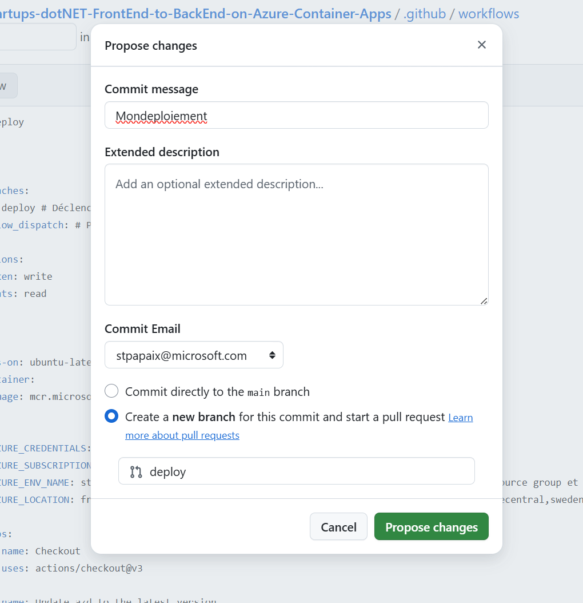
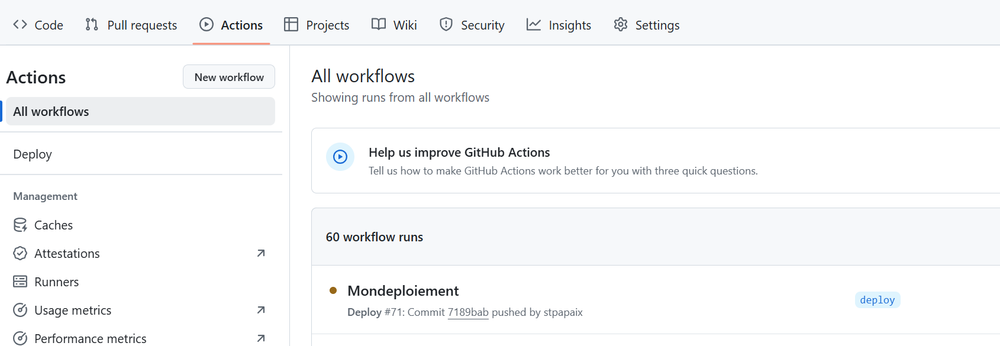
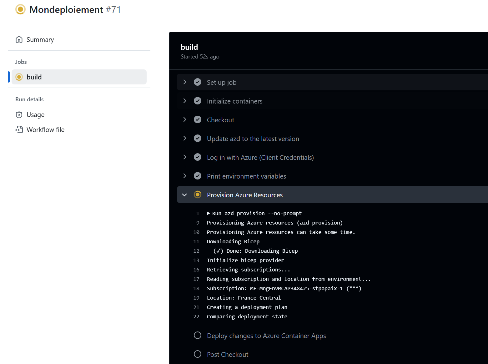

# Front-end ASP.NET Core + 2 API back-end sur Azure Container Apps

Ce dépôt contient un scénario simple construit pour démontrer comment ASP.NET Core 6.0 peut être utilisé pour créer une application cloud-native hébergée dans Azure Container Apps. Le dépôt se compose des éléments suivants :

* Store - Un projet serveur Blazor représentant le frontend d'une boutique en ligne. L'interface utilisateur de la boutique affiche une liste de tous les produits de la boutique et leur statut d'inventaire associé.
* Products API - Une API simple qui génère des noms de produits fictifs en utilisant le package open-source NuGet [Bogus](https://github.com/bchavez/Bogus).
* Inventory API - Une API simple qui fournit un nombre aléatoire pour un identifiant de produit donné. Les valeurs de chaque paire chaîne/entier sont stockées en cache mémoire pour être cohérentes entre les appels API.
* Dossier Azure - contient les fichiers Azure Bicep utilisés pour créer et configurer toutes les ressources Azure.
* Fichier de workflow GitHub Actions utilisé pour déployer l'application en utilisant CI/CD.

## Ce que vous apprendrez

Cet exercice vous présentera une variété de concepts, avec des liens vers la documentation tout au long du tutoriel.

* [Azure Container Apps](https://docs.microsoft.com/azure/container-apps/overview)
* [GitHub Actions](https://github.com/features/actions)
* [Azure Container Registry](https://docs.microsoft.com/azure/container-registry/)
* [Azure Bicep](https://docs.microsoft.com/azure/azure-resource-manager/bicep/overview?tabs=**bicep**)

## Prérequis

Vous aurez besoin de :

1. Un abonnement Azure.
2. Un compte GitHub, avec accès à GitHub Actions.
3. Soit le [Azure CLI](https://docs.microsoft.com/cli/azure/install-azure-cli) installé localement, ou bien un accès a Azure Cloud Shell depuis le portal Azure.

## Diagramme de topologie

L'application est un ensemble 3 conteneurs hébergés dans un environnement Azure Container Apps - l'API `products`, l'API `inventory` et le frontend Blazor Server `store`.


Le trafic Internet ne doit pas pouvoir accéder directement aux API back-end car chacun de ces conteneurs est marqué comme "internal ingress only" pendant la phase de déploiement.

Le trafic Internet accédant à l'URL `store.<your app>.<your region>.azurecontainerapps.io` doit être acheminé vers le conteneur `frontend`, qui à son tour effectue des appels interne, au sein de l'environnement Azure Container Apps, vers les API `products` et `inventory`.

## Configuration

À la fin de cette section, vous aurez une application contenant 3 nœuds fonctionnant dans Azure Container Apps. 
Cette application utilise un modèle de deploiement de type `consumption` qui est `serverless`


Ce processus de configuration se compose de deux étapes et devrait vous prendre environ 15 minutes.

1. Utilisez le CLI Azure pour créer `Azure Service Principal`, puis stockez la définition JSON de ce principal dans un secret GitHub afin que le processus CI/CD de GitHub Actions puisse se connecter à votre souscription Azure et déployer le code.
2. Modifiez le fichier de workflow `deploy.yml` et poussez les modifications dans une nouvelle branche `deploy`, ce qui déclenchera GitHub Actions pour créer l'environnement Container Apps, construire des containers pour les projets .NET  et pousser ces conteneurs l'environnement Container Apps.

## Authentification à Azure et configuration du dépôt avec un secret

1. "Forkez" ce dépôt dans votre propre organisation GitHub.
2. Créez un `Azure Service Principal` en utilisant le `Azure CLI`.

```bash
$subscriptionId=$(az account show --query id --output tsv)
az ad sp create-for-rbac --sdk-auth --name WebAndApiSample --role owner --scopes /subscriptions/$subscriptionId
```

3. Copiez le JSON écrit à l'écran dans votre presse-papiers.

```json
{
  "clientId": "",
  "clientSecret": "",
  "subscriptionId": "",
  "tenantId": "",
  "activeDirectoryEndpointUrl": "https://login.microsoftonline.com/",
  "resourceManagerEndpointUrl": "https://brazilus.management.azure.com",
  "activeDirectoryGraphResourceId": "https://graph.windows.net/",
  "sqlManagementEndpointUrl": "https://management.core.windows.net:8443/",
  "galleryEndpointUrl": "https://gallery.azure.com",
  "managementEndpointUrl": "https://management.core.windows.net"
}
```

4. Créez un nouveau secret GitHub dans votre fork nommé `AzureSPN`. Collez le JSON retourné par le CLI Azure dans ce nouveau secret.

   

Créez un deuxième secret GitHub dans votre fork nommé `AZURE_SUBSCRIPTION_ID`. Fournissez l'identifiant de la souscription Azure spécifique que vous souhaitez utiliser comme valeur pour ce secret. 
Une fois terminé vous verrez les 2 secrets

   

Remarque : Ne jamais sauvegarder le JSON sur disque, car cela permettrait à quiconque obtenant ce code JSON de créer ou de modifier des ressources dans votre abonnement Azure.!!!

## Déployer le code en utilisant GitHub Actions

Le moyen le plus simple de déployer le code est de faire un commit directement dans la branche deploy. Faites-le en naviguant dans le fichier deploy.yml dans votre navigateur et en cliquant sur le bouton Edit.


Fournissez un nom d'environnement personnalisé qui sera utilisé pour le nom de `Resssource Group` Azure , puis validez la modification dans une nouvelle branche nommée `deploy`.



Une fois que vous aurez cliqué sur le bouton `Propose changes`, vous serez en mode "creation d'un pull request". Ne vous inquiétez avec le `pull request` pour le moment, cliquez simplement sur l'onglet Actions, et vous verrez que le déploiement va démarrer...



Lorsque vous cliquez dans le workflow, vous verrez qu'il y a les phases que le CI/CD parcourra :

provision - les ressources Azure seront créées pour héberger votre application.

build - les différents projets .NET sont construits dans des conteneurs et publiés dans l'instance Azure Container Registry créée pendant la provision.

deploy - une fois build terminé, les images sont dans ACR, donc les Azure Container Apps sont mises à jour pour héberger les images de conteneurs nouvellement publiées.




Après quelques minutes, les étapes du workflow seront terminées, et chaque étape dans le diagramme du workflow affichera son état d'execution. Si quelque chose échoue, vous pouvez cliquer dans les étapes du processus pour examiner les détails.


Avec les projets déployés sur `Azure Container Apps`, vous pouvez maintenant tester l'application pour vous assurer qu'elle fonctionne.

## Tester l'application dans Azure

Le processus CI/CD deploy crée une série de ressources dans votre abonnement Azure. Celles-ci sont principalement utilisées pour héberger le code du projet, mais il y a également quelques ressources supplémentaires qui aident avec...

| Resource  | Resource Type                                                | Purpose                                                      |
| --------- | ------------------------------------------------------------ | ------------------------------------------------------------ |
| storeai   | Application Insights                                         | This provides telemetry and diagnostic information for when I want to monitor how the app is performing or for when things need troubleshooting. |
| store     | An Azure Container App that houses the code for the front end. | The store app is the store's frontend app, running a Blazor Server project that reaches out to the backend APIs |
| products  | An Azure Container App that houses the code for a minimal API. | This API is a Swagger UI-enabled API that hands back product names and IDs to callers. |
| inventory | An Azure Container App that houses the code for a minimal API. | This API is a Swagger UI-enabled API that hands back quantities for product IDs. A client would need to call the `products` API first to get the product ID list, then use those product IDs as parameters to the `inventory` API to get the quantity of any particular item in inventory. |
| storeenv  | An Azure Container Apps Environment                          | This environment serves as the networking meta-container for all of the instances of all of the container apps comprising the app. |
| storeacr  | An Azure Container Registry                                  | This is the container registry into which the CI/CD process publishes my application containers when I commit code to the `deploy` branch. From this registry, the containers are pulled and loaded into Azure Container Apps. |
| storelogs | Log Analytics Workspace                                      | This is where I can perform custom [Kusto](https://docs.microsoft.com/azure/data-explorer/kusto/query/) queries against the application telemetry, and time-sliced views of how the app is performing and scaling over time in the environment. |

Les ressources sont montrées ici dans le portail Azure :


Cliquez sur l'application Container Apps `store` pour l'ouvrir dans le portail Azure. Dans l'onglet `Overview`, vous verrez une URL.


En cliquant sur cette URL, vous ouvrirez le frontend de l'application dans le navigateur.


Vous verrez que la première demande prendra légèrement plus de temps que les demandes suivantes. Lors de la première demande de la page, les API sont appelées côté serveur. Le code utilise `IMemoryCache`.

